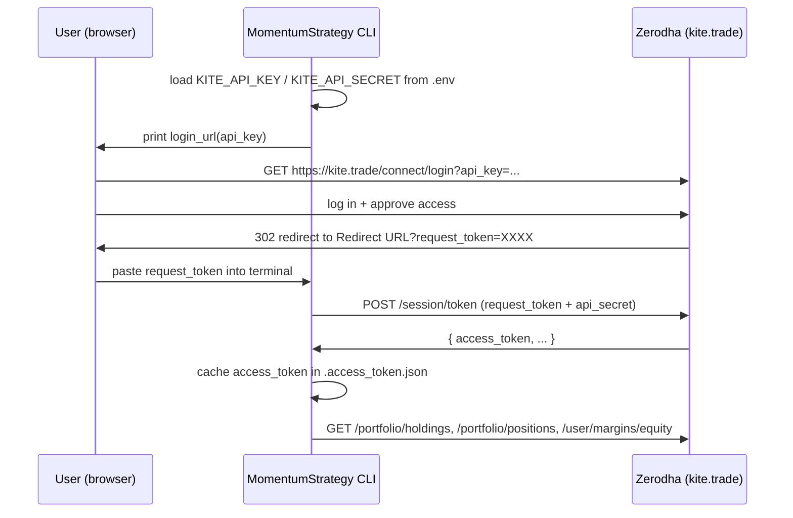

# MomentumStrategy

A small Python CLI that lists all equity holdings, current open positions
(equity and F&O), and the equity cash balance in your Zerodha account
using the official [Kite Connect](https://kite.trade) Python client
([pykiteconnect](https://github.com/zerodha/pykiteconnect)).

## What it does

- Authenticates against Zerodha using your Kite Connect API key + secret.
- Calls `kite.holdings()` and prints a table of every stock you own with:
  symbol, exchange, quantity, average price, last price, invested value,
  current value, P&L, and day change %.
- Calls `kite.positions()` and prints two separate tables for currently
  open positions (qty != 0):
    - **Equity** positions on NSE / BSE.
    - **F&O / derivatives** positions on NFO / BFO / CDS / BCD / MCX.
- Calls `kite.margins(segment="equity")` and prints the available cash,
  live balance, and utilised margin for the equity segment.
- Caches the daily access token in `.access_token.json` so you don't have to
  log in again until it expires (Kite tokens die at ~6 AM the next trading day).

## Prerequisites

- Python 3.10 or newer.
- A Kite Connect app on <https://developers.kite.trade>.
  - Note your **API key** and **API secret**.
  - Set the **Redirect URL** to anything you control. The app does not run a
    web server; you just need to be able to read the `request_token` query
    parameter from the URL the browser is redirected to. Something like
    `https://127.0.0.1` is fine.

## Setup

From the project root (`E:\MomentumStrategy`):

```powershell
python -m venv .venv
.\.venv\Scripts\Activate.ps1
pip install -r requirements.txt
```

Then edit [`.env`](.env) and fill in your credentials:

```
KITE_API_KEY=your_api_key_here
KITE_API_SECRET=your_api_secret_here
```

`.env` is gitignored, so it will not be committed.

## Run

```powershell
python -m app.main
```

On the first run (and once per day after the access token expires), you will
see something like:

```
Kite Connect login required.
1) Open this URL in your browser and log in to Zerodha:
   https://kite.trade/connect/login?api_key=...&v=3

2) After login Zerodha redirects to your app's Redirect URL.
   Copy the value of the `request_token` query parameter from
   that redirected URL (it looks like ?request_token=XXXX&...).

Paste request_token here:
```

Open the URL, log in to Zerodha, copy the `request_token` from the redirect
URL's query string, and paste it back into the terminal. After that, your
holdings table is printed.

## Project layout

```
.
├── .env                  # your Kite API key + secret (gitignored)
├── .env.example          # template for the above
├── .gitignore
├── README.md
├── requirements.txt
├── .access_token.json    # cached daily access token (gitignored, auto-created)
└── app/
    ├── __init__.py       # package docstring + module index
    ├── auth.py           # Kite login flow + token caching
    └── main.py           # entry point: holdings, positions, cash balance
```

## Kite Connect API reference

External documentation for everything this app talks to:

- **Kite Connect HTTP API (v3) overview** —
  <https://kite.trade/docs/connect/v3/>
- **Official Python client (`pykiteconnect`) source** —
  <https://github.com/zerodha/pykiteconnect>
- **`pykiteconnect` v4 API reference** —
  <https://kite.trade/docs/pykiteconnect/v4/>
- **Kite Connect developer console** (where you create the app, set the
  Redirect URL, and get your `api_key` / `api_secret`) —
  <https://developers.kite.trade/>

### Endpoints used by this app

| Where used                  | `pykiteconnect` method                | HTTP endpoint                 | Docs                                                                                                                                          |
| --------------------------- | ------------------------------------- | ----------------------------- | --------------------------------------------------------------------------------------------------------------------------------------------- |
| `app/auth.py`               | `KiteConnect.login_url()`             | (URL builder, no HTTP call)   | <https://kite.trade/docs/pykiteconnect/v4/#kiteconnect.KiteConnect.login_url>                                                                 |
| `app/auth.py`               | `KiteConnect.generate_session()`      | `POST /session/token`         | <https://kite.trade/docs/connect/v3/user/#login-flow> · <https://kite.trade/docs/pykiteconnect/v4/#kiteconnect.KiteConnect.generate_session>  |
| `app/auth.py`               | `KiteConnect.set_access_token()`      | (in-memory)                   | <https://kite.trade/docs/pykiteconnect/v4/#kiteconnect.KiteConnect.set_access_token>                                                          |
| `app/auth.py` (validation)  | `KiteConnect.profile()`               | `GET /user/profile`           | <https://kite.trade/docs/connect/v3/user/#user-profile> · <https://kite.trade/docs/pykiteconnect/v4/#kiteconnect.KiteConnect.profile>         |
| `app/auth.py` (error)       | `kiteconnect.exceptions.TokenException` | (raised on 403 token errors) | <https://kite.trade/docs/pykiteconnect/v4/#kiteconnect.exceptions.TokenException>                                                             |
| `app/main.py` `_print_holdings`     | `KiteConnect.holdings()`      | `GET /portfolio/holdings`     | <https://kite.trade/docs/connect/v3/portfolio/#holdings> · <https://kite.trade/docs/pykiteconnect/v4/#kiteconnect.KiteConnect.holdings>       |
| `app/main.py` `_print_positions`    | `KiteConnect.positions()`     | `GET /portfolio/positions`    | <https://kite.trade/docs/connect/v3/portfolio/#positions> · <https://kite.trade/docs/pykiteconnect/v4/#kiteconnect.KiteConnect.positions>     |
| `app/main.py` `_print_cash_balance` | `KiteConnect.margins("equity")` | `GET /user/margins/equity`  | <https://kite.trade/docs/connect/v3/user/#funds-and-margins> · <https://kite.trade/docs/pykiteconnect/v4/#kiteconnect.KiteConnect.margins>    |

### Login flow used by `app/auth.py`

Kite Connect uses a 3-legged interactive login. There is no plain
username/password API for third parties. The exchange looks like:



The `access_token` returned by `generate_session` is valid until
approximately **6 AM IST the next trading day**. After expiry, the next
call surfaces a
[`TokenException`](https://kite.trade/docs/pykiteconnect/v4/#kiteconnect.exceptions.TokenException),
the cache is discarded, and the interactive login runs again.

### Field reference for the data shown

For complete schemas of every field returned by these endpoints (we use
only a subset), refer to the Kite Connect HTTP API docs:

- **Holdings entry fields** —
  <https://kite.trade/docs/connect/v3/portfolio/#holdings>
- **Positions entry fields** (with `net` vs `day` semantics) —
  <https://kite.trade/docs/connect/v3/portfolio/#positions>
- **Margins / funds response** (per segment) —
  <https://kite.trade/docs/connect/v3/user/#funds-and-margins>
- **Exchange & segment codes** (NSE / BSE / NFO / BFO / CDS / BCD / MCX) —
  <https://kite.trade/docs/connect/v3/exchange/>
- **Order constants** (variety, product, order_type, validity) —
  <https://kite.trade/docs/connect/v3/orders/#constants>
  (not used yet, but referenced by the pykiteconnect class constants
  `kite.PRODUCT_*`, `kite.EXCHANGE_*`, etc.)

## Notes

- This script only reads. It calls `kite.holdings()`, `kite.positions()`,
  `kite.margins()` and `kite.profile()` (the last only to validate the
  cached token). It does not place, modify, or cancel any orders.
- For positions, the script uses the `net` view (consolidated current
  positions) and filters out closed/zero-quantity rows. If you also want to
  see intraday round-trips that net to zero, switch to `positions["day"]`
  inside `_print_positions`.
- Mutual fund holdings are not included; use
  [`kite.mf_holdings()`](https://kite.trade/docs/pykiteconnect/v4/#kiteconnect.KiteConnect.mf_holdings)
  if you want those too.
- Index constituents (e.g. NIFTY 50) are **not** part of Kite Connect. Use
  the NSE Indices CSV at
  <https://nsearchives.nseindia.com/content/indices/ind_nifty50list.csv>
  (note: NSE applies anti-bot protection; you'll need a session warm-up
  with browser-like headers to fetch it server-side).
