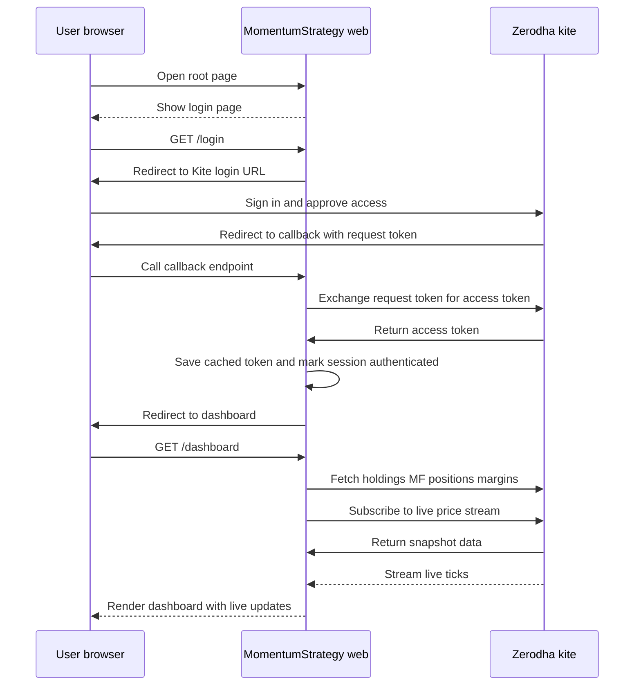
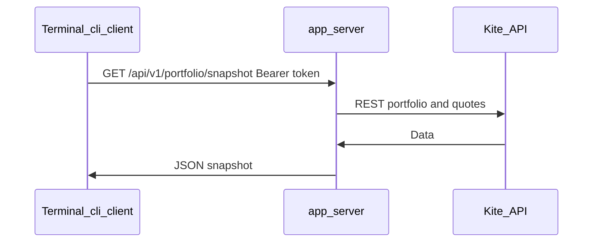

# MomentumStrategy

A small Python app (CLI **and** local web dashboard) that surfaces the
current state of your Zerodha account using the official
[Kite Connect](https://kite.trade) Python client
([pykiteconnect](https://github.com/zerodha/pykiteconnect)). It shows:

- Equity holdings (long-term stocks held in demat).
- Mutual fund holdings (units per folio with NAV and P&L).
- Open positions, separated into equity (NSE / BSE) and F&O / derivatives.
- Equity segment cash balance (available cash, live balance, utilised).
- Overall portfolio summary (invested/current totals and consolidated P&L
  across holdings, mutual funds, and open positions).

There are two interfaces, sharing the same authentication flow and token cache:

- **CLI** — `python -m app.cli_client` (or `python -m app.cli_client` shim). Talks to
  the local server over HTTP and prints the same sections as ASCII tables. The
  server must be running and you must be logged in via the browser once so the
  Kite access token is on disk. Use `Authorization: Bearer` under the hood.
- **Web dashboard** — `python -m app.server` (or `python -m app.server` shim).
  Starts a FastAPI server on http://127.0.0.1:5000/ with portfolio summary
  cards, tabs, live equity/F&O prices via Kite WebSocket (`KiteTicker`), and
  JSON APIs under `/api/v1/`.

Both interfaces use the same server-side domain/model layer in
`app/portfolio_model.py` for holdings/MF/positions normalization and aggregates.

## Architecture

The app is organized in three layers:

1. **Data sources / clients**
   - Kite Connect (`app/auth.py`, `app/live_prices.py`, `app/portfolio_model.py`)
   - NSE India archives (`app/cache/nse_provider.py`, consumed via `app/portfolio_model.py`)
   - External metadata (`yfinance`, `mfdata.in`)
   - MarketSmith India (public gateway for current market regime; model layer only)
2. **Shared model layer**
   - `app/portfolio_model.py`
   - Builds normalized holdings/MF/positions entities and shared aggregates
   - Owns MF-underlyings metadata cache section inside `.cache/model_cache.json`
   - Owns MarketSmith regime snapshot section (one fetch per business day) in `.cache/model_cache.json`
3. **Presentation layers**
   - CLI: `app/cli_client.py` (HTTP client, ASCII tables)
   - Web: `app/server.py` + `templates/` (FastAPI + HTML tabs + WS updates)

```text
Kite / NSE India / yfinance / mfdata / MarketSmith India
          |
          v
  app/portfolio_model.py   <- shared normalization + aggregation + metadata cache
      |             |
      v             v
  app/cli_client.py     app/server.py
    (CLI)      (Dashboard UI)
```

Design intent: UI code stays independent from business/data-model logic; both
CLI and dashboard should only format/render model outputs.

Contribution guideline: add or change portfolio calculations/normalization in
`app/portfolio_model.py` first, then adapt CLI/web rendering if needed.

## What it does

- Shows your full portfolio in one place across:
  - Equity holdings
  - Mutual fund holdings
  - Open positions (equity and F&O)
  - Cash/margin balance
- Adds account profile and Nifty 50 watch list snapshots in the CLI.
- Gives both a **CLI view** and a **local web dashboard**, so you can choose
  terminal output or a visual tabbed UI.
- Displays live market movement in the dashboard, including refreshed
  holdings/positions values and P&L.
- Provides a portfolio summary with key totals such as invested value,
  current value, and overall profit/loss.
- Adds mutual fund underlying insights (stock/sector breakdown and weights)
  in both dashboard and CLI when holdings data is available from `mfdata.in`.
- Shows the India **market regime** from MarketSmith India (Confirmed Uptrend,
  Correction, etc.) on the dashboard; the value is resolved in
  `app/portfolio_model.get_marketsmith_market_condition()` and surfaced in HTML
  and in ``dashboard-bootstrap`` as ``marketCondition`` for client scripts on load.
- Reuses login state between runs, so day-to-day usage usually requires less
  repeated sign-in.

## Prerequisites

- Python 3.10 or newer.
- A Kite Connect app on <https://developers.kite.trade>.
  - Note your **API key** and **API secret**.
  - **Redirect URL** depends on which interface you use most:
    - For the **web dashboard** (recommended), set the Redirect URL in
      your Kite Connect app to **`http://127.0.0.1:5000/callback`**.
      Zerodha allows `http://127.0.0.1` and `http://localhost` URLs for
      development.
    - For the **CLI**, use a local HTTP redirect URL (for automatic token
      capture), for example **`http://127.0.0.1:5000/callback`**.
      You can override it with `KITE_REDIRECT_URL` in `.env`.
      If auto-capture is unavailable, CLI falls back to manual paste.

## Setup

From the project root (`E:\MomentumStrategy`):

```powershell
python -m venv .venv
.\.venv\Scripts\Activate.ps1
pip install -r requirements.txt
```

Then edit [`.env`](.env) and fill in your credentials:

```
KITE_API_KEY=your_api_key_here
KITE_API_SECRET=your_api_secret_here
KITE_DASHBOARD_NAME=Raghava's Portfolio
# Optional: live index quotes under the dashboard title (NSE). Default: NIFTY50,BANKNIFTY,NIFTYIT,NIFTYFINSERVICE,NIFTYMET
# KITE_DASHBOARD_INDICES=NIFTY50,BANKNIFTY,NIFTYIT,NIFTYFINSERVICE,NIFTYMET
DASHBOARD_SNAPSHOT_SECONDS=120
# optional: shared TTL for reference cache entries (cash-equity + NSE maps + Nifty50)
REFERENCE_CACHE_TTL_SECONDS=86400
# optional for CLI auto request_token capture
KITE_REDIRECT_URL=http://127.0.0.1:5000/callback
```

Optional for the web dashboard: `SESSION_SECRET` (stable cookie signing across
restarts). If omitted, the app prefers the OS keychain; see `.env.example`.

`.env` is gitignored, so it will not be committed.

## Run — Web dashboard (recommended)

Best for day-to-day use if you want a visual portfolio view with live updates.
You get summary cards, tabbed sections, and automatic refresh behavior in one
local page.

```powershell
python -m app.server
```

`python -m app.server` sets a **5 second** graceful shutdown timeout so Ctrl+C
does not wait indefinitely on open WebSocket connections. It also **opens your
default browser** to the dashboard URL after about one second (only when using
``python -m app.server``). If you start Uvicorn yourself
(``uvicorn app.server:app --host 127.0.0.1 --port 5000``), open the URL manually
and pass ``--timeout-graceful-shutdown 5`` (or similar) for the same shutdown
behaviour.

This starts a FastAPI server on http://127.0.0.1:5000/. If the browser did not
open, visit that URL, click **Login with Zerodha**, complete the Zerodha
sign-in, and you'll be redirected to the dashboard.

The dashboard is a single page: **summary cards** at the top (total invested,
current value, overall P&L, open positions P&L), then five tabs:

1. **Equity Holdings** — table of demat stocks with totals.
2. **Mutual Funds** — MF folio table with NAVs/totals plus an aggregated
   underlying holdings breakdown (instrument, sector, overall weight).
3. **Equity Positions** — open NSE / BSE positions.
4. **F&O Positions** — open NFO / BFO / CDS / BCD / MCX positions.
5. **Cash Balance** — available cash, live balance, utilised.

The page automatically re-fetches a full HTML snapshot at the interval set by
``DASHBOARD_SNAPSHOT_SECONDS`` (mutual funds, cash, margins, and structural
changes); live LTP and row-level P&L updates arrive over WebSocket between
those snapshots. Click **Logout** to clear the browser session **and** delete
the on-disk token cache so both dashboard and CLI require a fresh Zerodha login.

## Sector data source and cache

The dashboard's **Sector** column for equities (holdings, equity positions, and
watch list) is resolved in this order:

1. **ETF override**: if the symbol or instrument/company name contains `ETF`,
   sector is forced to `ETF`.
2. **Local model cache** (`.cache/model_cache.json`) using the
   `sector` field.
3. **Background yfinance refresh** is queued on cache miss (non-blocking for
   the request path). The refreshed value is written back to the local cache.
4. **Kite instruments `sector`** field (when available for the equity row).
5. **NSE index CSV `Industry`** fallback (coarse backup label).
6. **ISIN -> Industry** fallback from the same NSE CSV merges.

Notes:
- `Industry` may appear as fallback text if a true sector is unavailable.
- ETFs are intentionally mapped to `ETF` because exchange/API sector metadata is
  commonly missing or inconsistent for ETFs.
- yfinance cache refresh runs in background about once every 30 days.
- The dashboard also warms heavy reference caches in the background on startup
  and after successful login (`/callback`) to reduce cold-load latency.
- Reference cache TTL defaults to 1 day and can be configured via
  `REFERENCE_CACHE_TTL_SECONDS` in `.env`.

## Dashboard timing logs

Per-request dashboard timing is written to:

- `.cache/dashboard_timing.log`

Each line includes total duration and cumulative stage marks (for example:
`kite_data_fetch_parallel`, `instrument_and_reference_lookups`,
`live_price_stream_bootstrap`) to help isolate bottlenecks.

### Build initial caches offline (recommended)

To keep first app launch fast, pre-warm local caches before running the
dashboard/CLI:

```powershell
python scripts/build_cache.py --workers 6
```

This writes/updates:
- `.cache/model_cache.json`
  - `yfinance` (industry/sector mapping)
  - `reference_data` (NSE industry maps, Nifty 50 list, cash-equity lookups)
  - `mfdata` (search/family-holdings metadata used by CLI/dashboard enrichment)
  - `marketsmith` (daily market regime snapshot)

Optional backfill for older cache rows that have industry but missing sector:

```powershell
python scripts/build_cache.py --backfill-sector --workers 6
```

To skip shared reference cache warmup:

```powershell
python scripts/build_cache.py --skip-reference-cache
```

Reference-cache only warmup (skip yfinance):

```powershell
python scripts/build_cache.py --reference-only
```

## Run — CLI

Best for quick terminal checks, scripting, or remote-shell workflows. It prints
the same core portfolio sections as readable console output after login.

```powershell
python -m app.cli_client
```

Show only selected sections:

```powershell
python -m app.cli_client --sections profile equity mf summary
```

Hide selected sections:

```powershell
python -m app.cli_client --exclude-sections watchlist cash
```

Skip MF underlying enrichment (faster run, no `mfdata.in` aggregation call):

```powershell
python -m app.cli_client --no-mf-underlyings
```

List all available options (including section keys):

```powershell
python -m app.cli_client --help
```

On the first run (and once per day after the access token expires), CLI
opens the login URL in your default browser and tries to capture
`request_token` automatically from the local callback endpoint configured
by `KITE_REDIRECT_URL` (default: `http://127.0.0.1:5000/callback`).

You will see something like:

```
Kite Connect login required.
1) Open this URL in your browser and log in to Zerodha:
   https://kite.trade/connect/login?api_key=...&v=3
   (Opened automatically in your default browser.)

Redirect URL for CLI auto-capture: http://127.0.0.1:5000/callback
Attempting automatic request_token capture...

# if auto-capture fails, CLI falls back to:
Automatic capture unavailable. Falling back to manual entry.
2) After login Zerodha redirects to your app's Redirect URL.
   Copy the value of the `request_token` query parameter from
   that redirected URL (it looks like ?request_token=XXXX&...).

Paste request_token here:
```

After authentication succeeds, all sections are printed:

1. User Profile
2. Equity Holdings
3. Mutual Fund Holdings
4. MF Underlying Breakdown (via `mfdata.in`, unless `--no-mf-underlyings` is used)
5. Open Positions (Equity and F&O)
6. Equity Cash Balance
7. Watch List (Nifty 50 snapshot)
8. Overall Portfolio Summary

Section keys accepted by `--sections` / `--exclude-sections`:
`profile`, `equity`, `mf`, `positions`, `cash`, `watchlist`, `summary`.

## Project layout

```
.
├── .env                  # your Kite API key + secret (gitignored)
├── .env.example          # template for the above
├── .gitignore
├── README.md
├── requirements.txt
├── .access_token.json    # cached daily access token (gitignored, auto-created)
├── .cache/               # local runtime caches (gitignored)
│   ├── dashboard_timing.log
│   └── model_cache.json
├── app/
│   ├── __init__.py       # package docstring + entry point index
│   ├── auth.py           # Kite login flow + token caching (shared by CLI + web)
│   ├── live_prices.py    # KiteTicker websocket manager for live LTP snapshots
│   ├── cli_client.py     # CLI: HTTP client to local server
│   ├── main.py           # shim → cli_client
│   ├── server.py         # FastAPI app (dashboard + /api/v1)
│   ├── portfolio_model.py # shared data model + transforms used by CLI and web
│   └── web.py            # shim → server (ASGI app)
└── templates/
    ├── base.html         # shared layout + CSS
    ├── index.html        # login landing page
    └── dashboard.html    # tabbed dashboard
```

## Data Sources

This app combines several external sources:

- **Kite Connect** for account data and live prices.
- **NSE India archives** for index constituents and `Industry`/`ISIN` reference data.
- **yfinance** for equity metadata enrichment (`industry`/`sector`).
- **mfdata.in** for mutual-fund underlying holdings aggregation.
- **MarketSmith India** (William O'Neil India) for the published **current market
  regime** (via their public `getMarketHistory.json` gateway, same data as
  [Market Condition History](https://marketsmithindia.com/mstool/marketconditionhistory.jsp)).
  The dashboard does not send your Kite credentials to MarketSmith; only the
  optional `MARKETSMITH_MS_AUTH` query override in `.env` is ever sent if you set it.

### Zerodha Kite Connect (account and live prices)

Kite Connect is the primary source for account data and live market prices.

External documentation:

- **Kite Connect HTTP API (v3) overview** —
  <https://kite.trade/docs/connect/v3/>
- **Official Python client (`pykiteconnect`) source** —
  <https://github.com/zerodha/pykiteconnect>
- **`pykiteconnect` v4 API reference** —
  <https://kite.trade/docs/pykiteconnect/v4/>
- **Kite Connect developer console** (where you create the app, set the
  Redirect URL, and get your `api_key` / `api_secret`) —
  <https://developers.kite.trade/>

### Endpoints used by this app

| Where used                          | `pykiteconnect` method                       | HTTP endpoint                  | Docs                                                                                                                                                       |
| ----------------------------------- | -------------------------------------------- | ------------------------------ | ---------------------------------------------------------------------------------------------------------------------------------------------------------- |
| `app/auth.py` / `app/server.py:/login` | `KiteConnect.login_url()`                    | (URL builder, no HTTP call)    | <https://kite.trade/docs/pykiteconnect/v4/#kiteconnect.KiteConnect.login_url>                                                                              |
| `app/auth.py` / `app/server.py:/callback` | `KiteConnect.generate_session()`          | `POST /session/token`          | <https://kite.trade/docs/connect/v3/user/#login-flow> · <https://kite.trade/docs/pykiteconnect/v4/#kiteconnect.KiteConnect.generate_session>               |
| `app/auth.py`                       | `KiteConnect.set_access_token()`             | (in-memory)                    | <https://kite.trade/docs/pykiteconnect/v4/#kiteconnect.KiteConnect.set_access_token>                                                                       |
| `app/auth.py` (validation)          | `KiteConnect.profile()`                      | `GET /user/profile`            | <https://kite.trade/docs/connect/v3/user/#user-profile> · <https://kite.trade/docs/pykiteconnect/v4/#kiteconnect.KiteConnect.profile>                      |
| `app/auth.py` (error)               | `kiteconnect.exceptions.TokenException`      | (raised on 403 token errors)   | <https://kite.trade/docs/pykiteconnect/v4/#kiteconnect.exceptions.TokenException>                                                                          |
| `app/server.py` (`/dashboard`, `/api/v1/portfolio/snapshot`, MF JSON routes) | `KiteConnect.holdings()`                  | `GET /portfolio/holdings`      | <https://kite.trade/docs/connect/v3/portfolio/#holdings> · <https://kite.trade/docs/pykiteconnect/v4/#kiteconnect.KiteConnect.holdings>                    |
| `app/server.py` (same) | `KiteConnect.mf_holdings()`            | `GET /mf/holdings`             | <https://kite.trade/docs/connect/v3/mutual-funds/#mutual-fund-holdings> · <https://kite.trade/docs/pykiteconnect/v4/#kiteconnect.KiteConnect.mf_holdings>  |
| `app/server.py` (same) | `KiteConnect.positions()`                | `GET /portfolio/positions`     | <https://kite.trade/docs/connect/v3/portfolio/#positions> · <https://kite.trade/docs/pykiteconnect/v4/#kiteconnect.KiteConnect.positions>                  |
| `app/server.py` (same) | `KiteConnect.margins("equity")`       | `GET /user/margins/equity`     | <https://kite.trade/docs/connect/v3/user/#funds-and-margins> · <https://kite.trade/docs/pykiteconnect/v4/#kiteconnect.KiteConnect.margins>                 |
| `app/live_prices.py` · `app/server.py:/dashboard` | `KiteTicker.subscribe()` / `set_mode("ltp")` | `wss://ws.kite.trade` | <https://kite.trade/docs/connect/v3/websocket/> · <https://kite.trade/docs/pykiteconnect/v4/#kiteconnect.KiteTicker> |
| `app/server.py` WebSocket `/ws/live-prices` | (ticks from existing `KiteTicker` stream) | Browser ← JSON LTP deltas | Same WebSocket docs as above (feed is shared with server-side LTP cache). |
| `app/server.py:/favicon.ico` | (no Kite call) | `GET /favicon.ico` → **204** | Browsers request this automatically; empty response avoids 404 noise. |
| MF section (error)                  | `kiteconnect.exceptions.PermissionException` | (raised on 403 when MF API not enabled) | <https://kite.trade/docs/pykiteconnect/v4/#kiteconnect.exceptions.PermissionException>                                                            |

### Login flow used by `app/server.py`



### CLI flow (`app/cli_client.py`)

The CLI is an **HTTP client** to the local server. Log in once via the browser
dashboard so the access token is cached; the CLI then sends
`Authorization: Bearer` and prints tables from JSON.



The `access_token` returned by `generate_session` is valid until
approximately **6 AM IST the next trading day**. After expiry, the next
call surfaces a
[`TokenException`](https://kite.trade/docs/pykiteconnect/v4/#kiteconnect.exceptions.TokenException),
the cache is discarded, and the interactive login runs again.

### Field reference for the data shown

For complete schemas of every field returned by these endpoints (we use
only a subset), refer to the Kite Connect HTTP API docs:

- **Holdings entry fields** —
  <https://kite.trade/docs/connect/v3/portfolio/#holdings>
- **MF holdings entry fields** —
  <https://kite.trade/docs/connect/v3/mutual-funds/#mutual-fund-holdings>
- **Positions entry fields** (with `net` vs `day` semantics) —
  <https://kite.trade/docs/connect/v3/portfolio/#positions>
- **Margins / funds response** (per segment) —
  <https://kite.trade/docs/connect/v3/user/#funds-and-margins>
- **Exchange & segment codes** (NSE / BSE / NFO / BFO / CDS / BCD / MCX) —
  <https://kite.trade/docs/connect/v3/exchange/>
- **Mutual Funds API overview** (orders, SIPs, holdings, instruments) —
  <https://kite.trade/docs/connect/v3/mutual-funds/>
- **Order constants** (variety, product, order_type, validity) —
  <https://kite.trade/docs/connect/v3/orders/#constants>
  (not used yet, but referenced by the pykiteconnect class constants
  `kite.PRODUCT_*`, `kite.EXCHANGE_*`, etc.)
- **WebSocket streaming** (live quotes/LTP) —
  <https://kite.trade/docs/connect/v3/websocket/>

### yfinance (equity metadata enrichment)

The app uses `yfinance` only for equity metadata enrichment (`industry` and
`sector`) and does **not** use it for order/trade operations.

- **yfinance documentation** — <https://ranaroussi.github.io/yfinance/>
- **`Ticker` API reference** — <https://ranaroussi.github.io/yfinance/reference/api/yfinance.Ticker.html>
- **`Ticker.info` reference** — <https://ranaroussi.github.io/yfinance/reference/api/yfinance.Ticker.info.html>
- **PyPI package** — <https://pypi.org/project/yfinance/>

Used in:

- `app/cache/yfinance_provider.py` / `app/portfolio_model.py` — `yf.Ticker(...).info` for
  live/cache-backed industry and sector lookup.
- `scripts/build_cache.py` — `yf.Ticker(...).info` to pre-build
  `.cache/model_cache.json` offline.

### NSE India (constituents and industry reference data)

The app fetches NSE reference CSVs from `nsearchives.nseindia.com` to power:

- Nifty 50 watch-list symbol universe (`Symbol` column)
- Symbol/ISIN-to-industry fallback maps used in sector resolution

Method used in code:

- HTTP GET with Python `urllib.request.Request` + browser-like headers
  (`User-Agent`, `Accept`, `Referer`) in `app/cache/nse_provider.py`
- Parse CSV using `csv.DictReader`
- Merge selected files (for example Nifty 50/100/200/500 and mid/small-cap lists)
  into in-memory maps
- Persist and reuse via `.cache/model_cache.json` (`reference_data` section) with refresh policy
  (`REFERENCE_CACHE_TTL_SECONDS`)

### mfdata.in (MF underlying aggregation)

`mfdata.in` is used in the dashboard's Mutual Funds tab and in the CLI report
to enrich folio-level MF holdings with underlying equity composition and sector
weights.

- **Website** — <https://mfdata.in/>
- **API base** — `https://mfdata.in`
- **Fund/scheme search** — `GET /api/v1/search?q=<fund_name>`
- **Family holdings** — `GET /api/v1/families/{family_id}/holdings`
- **Fields used by this app** — `equity_holdings` entries with
  `stock_name`, `sector`, and `weight_pct` to compute overall underlying
  weights across all aggregated funds.
- **Coverage behavior** — schemes/families without holdings coverage are
  skipped from aggregation and shown as "Not aggregated" in the dashboard.
- **Local metadata cache** — mfdata search + family-holdings responses are
  cached to `.cache/model_cache.json` (`mfdata` section, shared by CLI and dashboard).
  Live market quotes/ticks are not persisted there.

### MarketSmith India (market regime / dashboard banner)

- **Tool page** —
  <https://marketsmithindia.com/mstool/marketconditionhistory.jsp>
- **HTTP** — `GET https://marketsmithindia.com/gateway/simple-api/ms-india/mshkSubscription/getMarketHistory.json?ms-auth=<token>`
- **Used in code** — `app/portfolio_model.get_marketsmith_market_condition()`
  returns the first ``marketHistory`` row (current regime, Nifty 50 move in
  regime, etc.), then `app/server.py:/dashboard` passes it into the template and
  into ``dashboard-bootstrap`` as ``marketCondition`` (camelCase) so browser
  code can read it as soon as `readBootstrap()` runs.

**Caching (aligned with other “day keyed” flows):** like MF holdings and MF
underlying payloads in `app/server.py`, the regime snapshot is keyed by **business
day (IST, rolling at 09:00)**. Warm responses are kept in memory for the process
lifetime; `.cache/model_cache.json` (`marketsmith` section) stores the same payload
so a **restart on the same day** does not refetch. Errors from the gateway are cached for that day as well so
a broken response does not retry on every `/dashboard` refresh. Optional
``.env``: ``MARKETSMITH_MS_AUTH`` only (see [.env.example](.env.example)).

| Where used | Call | Endpoint / artifact |
| ---------- | ---- | ------------------- |
| `app/portfolio_model` | urllib `GET` | `…/getMarketHistory.json` |
| `app/server.py:/dashboard` | `get_marketsmith_market_condition()` | Banner HTML + bootstrap JSON |

## Notes

- This app only reads. It calls `kite.holdings()`, `kite.mf_holdings()`,
  `kite.positions()`, `kite.margins()`, `kite.profile()`, and (for web)
  subscribes to live quote ticks via `KiteTicker`. It does not place,
  modify, or cancel any orders.
- The web dashboard binds to `127.0.0.1` only, so it is **not**
  reachable from other machines on the network. To expose it elsewhere,
  change the `host` argument in `app.server.main`.
- For positions, the app uses the `net` view (consolidated current
  positions) and filters out closed/zero-quantity rows. If you also
  want to see intraday round-trips that net to zero, switch to
  `positions["day"]` inside the `dashboard` route / `_print_positions`.
- The mutual funds section requires the Mutual Funds module to be
  enabled on your Kite Connect app (toggle it in the
  [developer console](https://developers.kite.trade)). If it isn't,
  both the CLI and the dashboard catch the resulting
  [`PermissionException`](https://kite.trade/docs/pykiteconnect/v4/#kiteconnect.exceptions.PermissionException)
  and surface a notice rather than failing.
- Index constituents (e.g. NIFTY 50) are **not** part of Kite Connect.
  Use the NSE Indices CSV at
  <https://nsearchives.nseindia.com/content/indices/ind_nifty50list.csv>
  (note: NSE applies anti-bot protection; you'll need a session warm-up
  with browser-like headers to fetch it server-side). See `## Data Sources`
  for the source summary used by this app.
