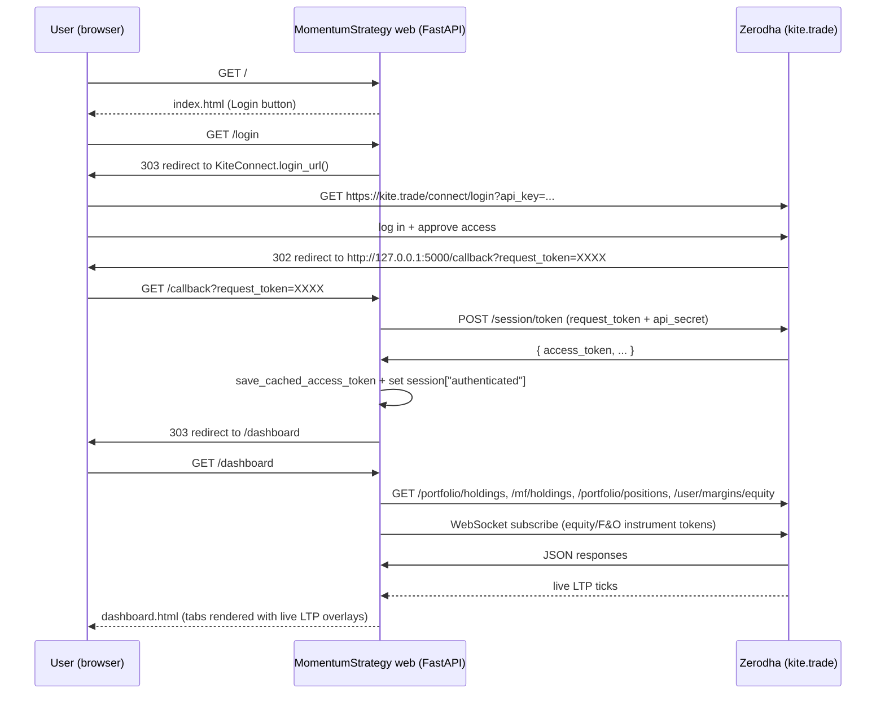
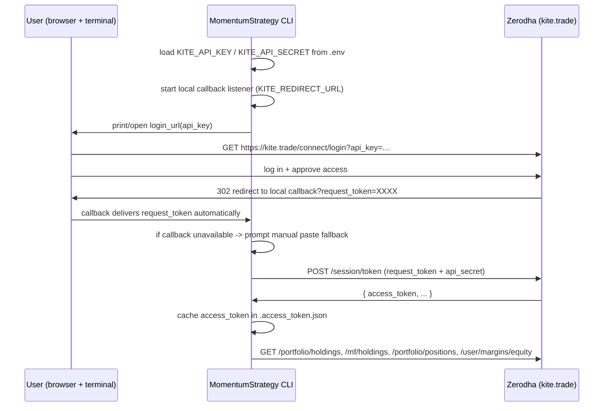

# MomentumStrategy

A small Python app (CLI **and** local web dashboard) that surfaces the
current state of your Zerodha account using the official
[Kite Connect](https://kite.trade) Python client
([pykiteconnect](https://github.com/zerodha/pykiteconnect)). It shows:

- Equity holdings (long-term stocks held in demat).
- Mutual fund holdings (units per folio with NAV and P&L).
- Open positions, separated into equity (NSE / BSE) and F&O / derivatives.
- Equity segment cash balance (available cash, live balance, utilised).
- Overall portfolio summary (invested/current totals and consolidated P&L
  across holdings, mutual funds, and open positions).

There are two interfaces, sharing the same authentication flow and token cache:

- **CLI** — `python -m app.main`. Prints these sections as ASCII tables (five
  blocks, including the portfolio summary), suitable for terminals and scripting.
- **Web dashboard** — `python -m app.web`. Starts a FastAPI server on
  http://127.0.0.1:5000/ with portfolio summary cards, one tab per category on
  a single page, and live equity/F&O prices overlaid via Kite WebSocket
  (`KiteTicker`).

## What it does

- Authenticates against Zerodha using your Kite Connect API key + secret.
- Calls `kite.holdings()` and renders every stock you own with: symbol,
  exchange, quantity, average price, last price, invested value, current
  value, P&L, and day change %.
- Calls `kite.mf_holdings()` and renders every mutual fund you own with:
  fund name, folio, units, average NAV, latest NAV, invested value,
  current value, and P&L. If the Mutual Funds module isn't enabled on
  your Kite Connect app, a friendly notice is shown instead.
- In the web dashboard, the Mutual Funds tab also builds a combined
  **underlying instrument + sector + overall MF weight** table using
  `mfdata.in` holdings. This is loaded lazily from
  `GET /dashboard/mf-underlyings` after the main page renders, so first
  paint is faster. Funds without holdings coverage on `mfdata.in` are
  skipped from aggregation and shown under a "Not aggregated" note with
  an `Aggregated funds: X / Y` count.
- Calls `kite.positions()` and shows two tables for currently open
  positions (`quantity != 0`):
    - **Equity** positions on NSE / BSE.
    - **F&O / derivatives** positions on NFO / BFO / CDS / BCD / MCX.
- Calls `kite.margins(segment="equity")` and shows available cash, live
  balance, and utilised margin for the equity segment.
- For the **web dashboard**, subscribes to equity/F&O instrument tokens
  over WebSocket (`KiteTicker`) and overlays live LTPs before rendering
  holdings/positions so current value, P&L, and day change are refreshed
  from streamed prices.
- Caches the daily access token in `.access_token.json` so you don't
  have to log in again until it expires (Kite tokens die at ~6 AM IST
  the next trading day). The CLI and web dashboard share this cache.
- Keeps the **browser session cookie** valid across server restarts by
  signing it with a stable secret: use env `SESSION_SECRET`, or the app
  stores one in the OS keychain via `keyring` (Windows Credential Manager,
  macOS Keychain, etc.). A legacy plaintext `.session_secret` file is
  migrated into the keychain when present. If no backend is available,
  you may see a **RuntimeWarning** and sessions reset on restart unless
  you set `SESSION_SECRET`.
- Streams live LTP ticks to the browser over ``WS /ws/live-prices`` and
  updates holdings/positions rows client-side without reloading the page.
- Periodically re-fetches a full HTML snapshot on ``GET /dashboard`` every
  ``DASHBOARD_SNAPSHOT_SECONDS`` (default **120** seconds; minimum **10**)
  so mutual funds, cash/margins, and structural changes stay in sync. If
  ``DASHBOARD_SNAPSHOT_SECONDS`` is unset, ``DASHBOARD_REFRESH_SECONDS`` is
  used as a fallback for that interval (legacy).
- Outbound live ticks are **coalesced** on the asyncio loop (fewer frames
  when the market is busy). Set ``DASHBOARD_DEBUG_WS=1`` for verbose logs
  if the WebSocket bridge or tick listeners misbehave.

## Prerequisites

- Python 3.10 or newer.
- A Kite Connect app on <https://developers.kite.trade>.
  - Note your **API key** and **API secret**.
  - **Redirect URL** depends on which interface you use most:
    - For the **web dashboard** (recommended), set the Redirect URL in
      your Kite Connect app to **`http://127.0.0.1:5000/callback`**.
      Zerodha allows `http://127.0.0.1` and `http://localhost` URLs for
      development.
    - For the **CLI**, use a local HTTP redirect URL (for automatic token
      capture), for example **`http://127.0.0.1:5000/callback`**.
      You can override it with `KITE_REDIRECT_URL` in `.env`.
      If auto-capture is unavailable, CLI falls back to manual paste.

## Setup

From the project root (`E:\MomentumStrategy`):

```powershell
python -m venv .venv
.\.venv\Scripts\Activate.ps1
pip install -r requirements.txt
```

Then edit [`.env`](.env) and fill in your credentials:

```
KITE_API_KEY=your_api_key_here
KITE_API_SECRET=your_api_secret_here
KITE_DASHBOARD_NAME=Raghava's Portfolio
# Optional: live index quotes under the dashboard title (NSE). Default: NIFTY50,BANKNIFTY,NIFTYIT,NIFTYFINSERVICE,NIFTYMET
# KITE_DASHBOARD_INDICES=NIFTY50,BANKNIFTY,NIFTYIT,NIFTYFINSERVICE,NIFTYMET
DASHBOARD_SNAPSHOT_SECONDS=120
# optional for CLI auto request_token capture
KITE_REDIRECT_URL=http://127.0.0.1:5000/callback
```

Optional for the web dashboard: `SESSION_SECRET` (stable cookie signing across
restarts). If omitted, the app prefers the OS keychain; see `.env.example`.

`.env` is gitignored, so it will not be committed.

## Run — Web dashboard (recommended)

```powershell
python -m app.web
```

`python -m app.web` sets a **5 second** graceful shutdown timeout so Ctrl+C
does not wait indefinitely on open WebSocket connections. It also **opens your
default browser** to the dashboard URL after about one second (only when using
``python -m app.web``). If you start Uvicorn yourself
(``uvicorn app.web:app --host 127.0.0.1 --port 5000``), open the URL manually
and pass ``--timeout-graceful-shutdown 5`` (or similar) for the same shutdown
behaviour.

This starts a FastAPI server on http://127.0.0.1:5000/. If the browser did not
open, visit that URL, click **Login with Zerodha**, complete the Zerodha
sign-in, and you'll be redirected to the dashboard.

The dashboard is a single page: **summary cards** at the top (total invested,
current value, overall P&L, open positions P&L), then five tabs:

1. **Equity Holdings** — table of demat stocks with totals.
2. **Mutual Funds** — MF folio table with NAVs/totals plus an aggregated
   underlying holdings breakdown (instrument, sector, overall weight).
3. **Equity Positions** — open NSE / BSE positions.
4. **F&O Positions** — open NFO / BFO / CDS / BCD / MCX positions.
5. **Cash Balance** — available cash, live balance, utilised.

The page automatically re-fetches a full HTML snapshot at the interval set by
``DASHBOARD_SNAPSHOT_SECONDS`` (mutual funds, cash, margins, and structural
changes); live LTP and row-level P&L updates arrive over WebSocket between
those snapshots. Click **Logout** to clear the browser session **and** delete
the on-disk token cache so both dashboard and CLI require a fresh Zerodha login.

## Sector data source and cache

The dashboard's **Sector** column for equities (holdings, equity positions, and
watch list) is resolved in this order:

1. **ETF override**: if the symbol or instrument/company name contains `ETF`,
   sector is forced to `ETF`.
2. **Local yfinance cache** (`.cache/yfinance_industry_cache.json`) using the
   `sector` field.
3. **Background yfinance refresh** is queued on cache miss (non-blocking for
   the request path). The refreshed value is written back to the local cache.
4. **Kite instruments `sector`** field (when available for the equity row).
5. **NSE index CSV `Industry`** fallback (coarse backup label).
6. **ISIN -> Industry** fallback from the same NSE CSV merges.

Notes:
- `Industry` may appear as fallback text if a true sector is unavailable.
- ETFs are intentionally mapped to `ETF` because exchange/API sector metadata is
  commonly missing or inconsistent for ETFs.
- yfinance cache refresh runs in background about once every 30 days.
- The dashboard also warms heavy reference caches in the background on startup
  and after successful login (`/callback`) to reduce cold-load latency.

## Dashboard timing logs

Per-request dashboard timing is written to:

- `.cache/dashboard_timing.log`

Each line includes total duration and cumulative stage marks (for example:
`kite_data_fetch_parallel`, `instrument_and_reference_lookups`,
`live_price_stream_bootstrap`) to help isolate bottlenecks.

### Build initial yfinance cache offline (recommended)

To keep first app launch fast, pre-warm the yfinance cache before running the
dashboard/CLI:

```powershell
python scripts/build_yfinance_cache.py --workers 6
```

This writes/updates:
- `.cache/yfinance_industry_cache.json`

Optional backfill for older cache rows that have industry but missing sector:

```powershell
python scripts/build_yfinance_cache.py --backfill-sector --workers 6
```

### yfinance API usage reference

The app uses `yfinance` only for equity metadata enrichment (`industry` and
`sector`) and does **not** use it for order/trade operations.

- **yfinance documentation** — <https://ranaroussi.github.io/yfinance/>
- **`Ticker` API reference** — <https://ranaroussi.github.io/yfinance/reference/api/yfinance.Ticker.html>
- **`Ticker.info` reference** — <https://ranaroussi.github.io/yfinance/reference/api/yfinance.Ticker.info.html>
- **PyPI package** — <https://pypi.org/project/yfinance/>

Where this app uses it:

- `app/instruments.py` — `yf.Ticker(f"{symbol}.{exchange}").info` for
  live/cache-backed industry and sector lookup.
- `scripts/build_yfinance_cache.py` — `yf.Ticker(...).info` to pre-build
  `.cache/yfinance_industry_cache.json` offline.

## Run — CLI

```powershell
python -m app.main
```

On the first run (and once per day after the access token expires), CLI
opens the login URL in your default browser and tries to capture
`request_token` automatically from the local callback endpoint configured
by `KITE_REDIRECT_URL` (default: `http://127.0.0.1:5000/callback`).

You will see something like:

```
Kite Connect login required.
1) Open this URL in your browser and log in to Zerodha:
   https://kite.trade/connect/login?api_key=...&v=3
   (Opened automatically in your default browser.)

Redirect URL for CLI auto-capture: http://127.0.0.1:5000/callback
Attempting automatic request_token capture...

# if auto-capture fails, CLI falls back to:
Automatic capture unavailable. Falling back to manual entry.
2) After login Zerodha redirects to your app's Redirect URL.
   Copy the value of the `request_token` query parameter from
   that redirected URL (it looks like ?request_token=XXXX&...).

Paste request_token here:
```

After authentication succeeds, all sections (including the portfolio
summary) are printed.

## Project layout

```
.
├── .env                  # your Kite API key + secret (gitignored)
├── .env.example          # template for the above
├── .gitignore
├── README.md
├── requirements.txt
├── .access_token.json    # cached daily access token (gitignored, auto-created)
├── app/
│   ├── __init__.py       # package docstring + entry point index
│   ├── auth.py           # Kite login flow + token caching (shared by CLI + web)
│   ├── live_prices.py    # KiteTicker websocket manager for live LTP snapshots
│   ├── main.py           # CLI entry point: holdings, MF, positions, cash
│   └── web.py            # FastAPI dashboard entry point (tabs)
└── templates/
    ├── base.html         # shared layout + CSS
    ├── index.html        # login landing page
    └── dashboard.html    # tabbed dashboard
```

## Kite Connect API reference

External documentation for everything this app talks to:

- **Kite Connect HTTP API (v3) overview** —
  <https://kite.trade/docs/connect/v3/>
- **Official Python client (`pykiteconnect`) source** —
  <https://github.com/zerodha/pykiteconnect>
- **`pykiteconnect` v4 API reference** —
  <https://kite.trade/docs/pykiteconnect/v4/>
- **Kite Connect developer console** (where you create the app, set the
  Redirect URL, and get your `api_key` / `api_secret`) —
  <https://developers.kite.trade/>

### Endpoints used by this app

| Where used                          | `pykiteconnect` method                       | HTTP endpoint                  | Docs                                                                                                                                                       |
| ----------------------------------- | -------------------------------------------- | ------------------------------ | ---------------------------------------------------------------------------------------------------------------------------------------------------------- |
| `app/auth.py` / `app/web.py:/login` | `KiteConnect.login_url()`                    | (URL builder, no HTTP call)    | <https://kite.trade/docs/pykiteconnect/v4/#kiteconnect.KiteConnect.login_url>                                                                              |
| `app/auth.py` / `app/web.py:/callback` | `KiteConnect.generate_session()`          | `POST /session/token`          | <https://kite.trade/docs/connect/v3/user/#login-flow> · <https://kite.trade/docs/pykiteconnect/v4/#kiteconnect.KiteConnect.generate_session>               |
| `app/auth.py`                       | `KiteConnect.set_access_token()`             | (in-memory)                    | <https://kite.trade/docs/pykiteconnect/v4/#kiteconnect.KiteConnect.set_access_token>                                                                       |
| `app/auth.py` (validation)          | `KiteConnect.profile()`                      | `GET /user/profile`            | <https://kite.trade/docs/connect/v3/user/#user-profile> · <https://kite.trade/docs/pykiteconnect/v4/#kiteconnect.KiteConnect.profile>                      |
| `app/auth.py` (error)               | `kiteconnect.exceptions.TokenException`      | (raised on 403 token errors)   | <https://kite.trade/docs/pykiteconnect/v4/#kiteconnect.exceptions.TokenException>                                                                          |
| `app/main.py:_print_holdings` · `app/web.py:/dashboard` | `KiteConnect.holdings()`                  | `GET /portfolio/holdings`      | <https://kite.trade/docs/connect/v3/portfolio/#holdings> · <https://kite.trade/docs/pykiteconnect/v4/#kiteconnect.KiteConnect.holdings>                    |
| `app/main.py:_print_mf_holdings` · `app/web.py:/dashboard` | `KiteConnect.mf_holdings()`            | `GET /mf/holdings`             | <https://kite.trade/docs/connect/v3/mutual-funds/#mutual-fund-holdings> · <https://kite.trade/docs/pykiteconnect/v4/#kiteconnect.KiteConnect.mf_holdings>  |
| `app/main.py:_print_positions` · `app/web.py:/dashboard` | `KiteConnect.positions()`                | `GET /portfolio/positions`     | <https://kite.trade/docs/connect/v3/portfolio/#positions> · <https://kite.trade/docs/pykiteconnect/v4/#kiteconnect.KiteConnect.positions>                  |
| `app/main.py:_print_cash_balance` · `app/web.py:/dashboard` | `KiteConnect.margins("equity")`       | `GET /user/margins/equity`     | <https://kite.trade/docs/connect/v3/user/#funds-and-margins> · <https://kite.trade/docs/pykiteconnect/v4/#kiteconnect.KiteConnect.margins>                 |
| `app/live_prices.py` · `app/web.py:/dashboard` | `KiteTicker.subscribe()` / `set_mode("ltp")` | `wss://ws.kite.trade` | <https://kite.trade/docs/connect/v3/websocket/> · <https://kite.trade/docs/pykiteconnect/v4/#kiteconnect.KiteTicker> |
| `app/web.py` WebSocket `/ws/live-prices` | (ticks from existing `KiteTicker` stream) | Browser ← JSON LTP deltas | Same WebSocket docs as above (feed is shared with server-side LTP cache). |
| `app/web.py:/favicon.ico` | (no Kite call) | `GET /favicon.ico` → **204** | Browsers request this automatically; empty response avoids 404 noise. |
| MF section (error)                  | `kiteconnect.exceptions.PermissionException` | (raised on 403 when MF API not enabled) | <https://kite.trade/docs/pykiteconnect/v4/#kiteconnect.exceptions.PermissionException>                                                            |

### Login flow used by `app/web.py`



### Login flow used by `app/main.py` (CLI)



The `access_token` returned by `generate_session` is valid until
approximately **6 AM IST the next trading day**. After expiry, the next
call surfaces a
[`TokenException`](https://kite.trade/docs/pykiteconnect/v4/#kiteconnect.exceptions.TokenException),
the cache is discarded, and the interactive login runs again.

### Field reference for the data shown

For complete schemas of every field returned by these endpoints (we use
only a subset), refer to the Kite Connect HTTP API docs:

- **Holdings entry fields** —
  <https://kite.trade/docs/connect/v3/portfolio/#holdings>
- **MF holdings entry fields** —
  <https://kite.trade/docs/connect/v3/mutual-funds/#mutual-fund-holdings>
- **Positions entry fields** (with `net` vs `day` semantics) —
  <https://kite.trade/docs/connect/v3/portfolio/#positions>
- **Margins / funds response** (per segment) —
  <https://kite.trade/docs/connect/v3/user/#funds-and-margins>
- **Exchange & segment codes** (NSE / BSE / NFO / BFO / CDS / BCD / MCX) —
  <https://kite.trade/docs/connect/v3/exchange/>
- **Mutual Funds API overview** (orders, SIPs, holdings, instruments) —
  <https://kite.trade/docs/connect/v3/mutual-funds/>
- **Order constants** (variety, product, order_type, validity) —
  <https://kite.trade/docs/connect/v3/orders/#constants>
  (not used yet, but referenced by the pykiteconnect class constants
  `kite.PRODUCT_*`, `kite.EXCHANGE_*`, etc.)
- **WebSocket streaming** (live quotes/LTP) —
  <https://kite.trade/docs/connect/v3/websocket/>

## Notes

- This app only reads. It calls `kite.holdings()`, `kite.mf_holdings()`,
  `kite.positions()`, `kite.margins()`, `kite.profile()`, and (for web)
  subscribes to live quote ticks via `KiteTicker`. It does not place,
  modify, or cancel any orders.
- MF underlying aggregation in the dashboard is sourced from
  [`mfdata.in`](https://mfdata.in/) only. If a scheme/family does not have
  holdings there, it is excluded from the combined underlying table and
  explicitly listed as "Not aggregated".
- The web dashboard binds to `127.0.0.1` only, so it is **not**
  reachable from other machines on the network. To expose it elsewhere,
  change the `host` argument in `app.web.main`.
- For positions, the app uses the `net` view (consolidated current
  positions) and filters out closed/zero-quantity rows. If you also
  want to see intraday round-trips that net to zero, switch to
  `positions["day"]` inside the `dashboard` route / `_print_positions`.
- The mutual funds section requires the Mutual Funds module to be
  enabled on your Kite Connect app (toggle it in the
  [developer console](https://developers.kite.trade)). If it isn't,
  both the CLI and the dashboard catch the resulting
  [`PermissionException`](https://kite.trade/docs/pykiteconnect/v4/#kiteconnect.exceptions.PermissionException)
  and surface a notice rather than failing.
- Index constituents (e.g. NIFTY 50) are **not** part of Kite Connect.
  Use the NSE Indices CSV at
  <https://nsearchives.nseindia.com/content/indices/ind_nifty50list.csv>
  (note: NSE applies anti-bot protection; you'll need a session warm-up
  with browser-like headers to fetch it server-side).

### Data Sources

- **Zerodha Kite Connect (account data)**:
  - Holdings: `GET /portfolio/holdings`
  - Mutual fund folios: `GET /mf/holdings`
  - Positions: `GET /portfolio/positions`
  - Cash/margins: `GET /user/margins/equity`
  - Profile: `GET /user/profile`
  - Live prices: `wss://ws.kite.trade` (`KiteTicker`)

- **mfdata.in (MF underlying aggregation)**:
  - Scheme/fund search: `GET /api/v1/search?q=<fund_name>`
  - Family holdings: `GET /api/v1/families/{family_id}/holdings`
  - Dashboard uses `equity_holdings` (`stock_name`, `sector`, `weight_pct`)
    to compute overall underlying weights across all available MF holdings.
